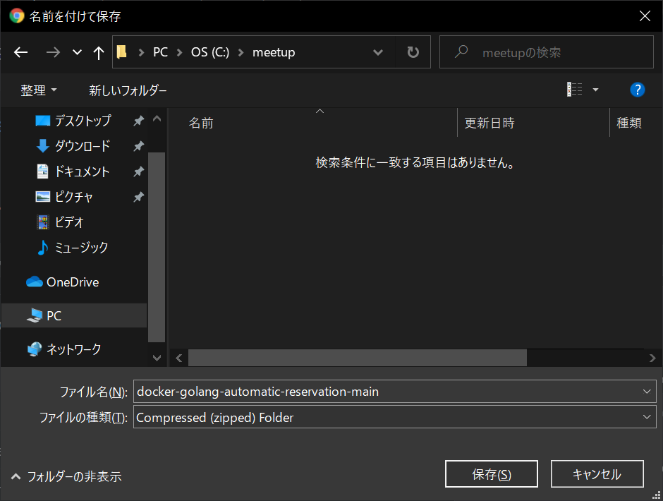

# 2. Dockerの準備

<!-- toc -->

## 2.1. プログラムをダウンロード

[こちら](https://github.com/miracleave-ltd/docker-golang-automatic-reservation)から`docker-golang-automatic-reservation-main`をZIPでダウンロードします。

下図のボタンからダウンロード可能です。


ここでは`C:\Users\{Your usename}\Projects`にダウンロードしたZIPファイルを解凍しています。
**※後述の動作確認の時に影響があるため。管理者権限が必要なディレクトリには解凍しないようにしましょう。**


## 2.2. Dockerイメージのビルド

コマンドプロンプトで解凍した`docker-golang-automatic-reservation-main`まで移動します。

```sh
cd C:\Users\{Your usename}\docker-golang-automatic-reservation-main
```

移動したら以下を実行します。
```sh
docker-compose build
# 完了するまでそこそこ時間がかかります…
```

## 2.3. コンテナの起動

前項が完了したら、ディレクトリはそのままで以下コマンドを実行します。

```sh
docker-compose up -d
```

更に以下のコマンドを実行しコンテナが正常に起動しているか確認します。

```sh
docker ps
# Creating docker-golang-automatic-reservation-main_app_1 ... done
# ↑のように「docker-golang-automatic-reservation-main_app_1」のコンテナがupしていればOK！
```