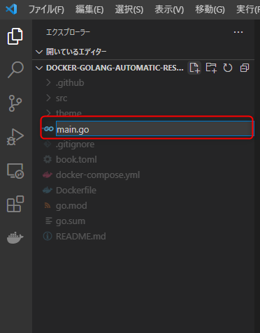
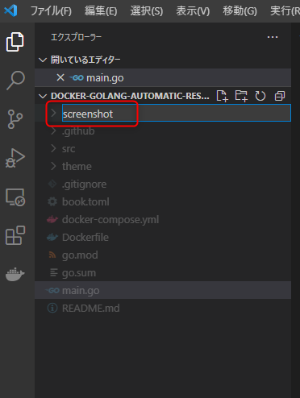

# 3. Goのプログラム作成

<!-- toc -->

## 3.1. main.goファイルの作成

まずは Go が正しく実行できていることを確認するためにメッセージを出力するところまで確認します。


`docker-golang-automatic-reservation-main`配下にある`main.go`ファイルを編集します。
下図のとおり、VS Codeなどのエディタで開いてHello Worldを出力させるよう編集します。



以下の内容を追加して保存します。

```go
package main

import "fmt"

func main() {
  fmt.Printf("Hello World\n")
}
```

## 3.2. コンテナに接続し、Goを実行

```bash
# コンテナの中に入る
docker exec -it docker-golang-automatic-reservation-main_app_1 bash
# main.goの実行
go run main.go
```

下図のように「Hello World」が出力されていれば成功。


## 3.3. Google Chromeを起動し、スクリーンショットを撮る

`docker-golang-automatic-reservation-main`配下に`screenshot`フォルダを作成します。




以下のとおり、`main.go`ファイルの編集を行います。

```go
// main.go
package main

import (
	"github.com/sclevine/agouti"
	"log"
)

func main() {
	// Chromeを利用することを宣言
	driver := agouti.ChromeDriver(
		agouti.ChromeOptions("args", []string{
			"--headless",
			"--disable-gpu",
			"--window-size=1280,1024",
			"--disable-dev-shm-usage",
			"--no-sandbox",
		}),
		agouti.Debug,
	)

	if err := driver.Start(); err != nil {
		log.Printf("Failed to start driver: %v", err)
	}
	defer driver.Stop()

	page, err := driver.NewPage(agouti.Browser("chrome"))
	if err != nil {
		log.Printf("Failed to open page: %v", err)
	}

	// Access to a target page
	url := "https://www.google.co.jp/"
	err = page.Navigate(url)
	if err != nil {
		log.Printf("Failed to navigate: %v", err)
	}
	// Get screen shot
	page.Screenshot("screenshot/Google.png")


	// ここに 4.1 のコードを追加します。

	// ここに 4.2 のコードを追加します。

	// ここに 4.4 のコードを追加します。
}
```

## 3.4. 再度コンテナに接続し、Goを実行

```
go run main.go
```

下記のようなエラーが発生した場合は`main.go`ファイルの文字コードをUTF-8に変更してください。

`./main.go:9:11: invalid UTF-8 encoding`

## 3.5. 実行結果の確認

スクリーンショットが作成されているか確認します。
`/docker-golang-automatic-reservation-main`配下に作成した`screenshot`フォルダに`Google.png`が作成されていればOKです。


